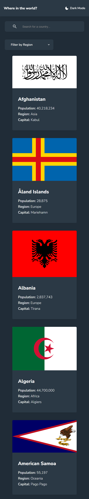
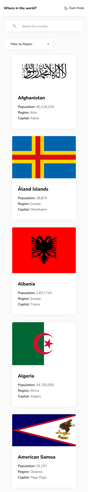
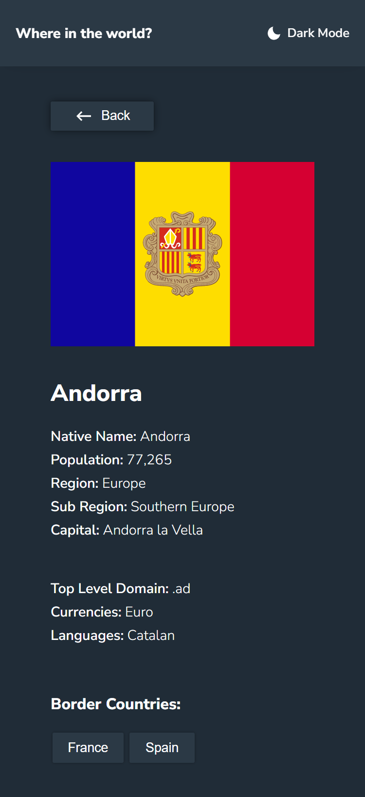
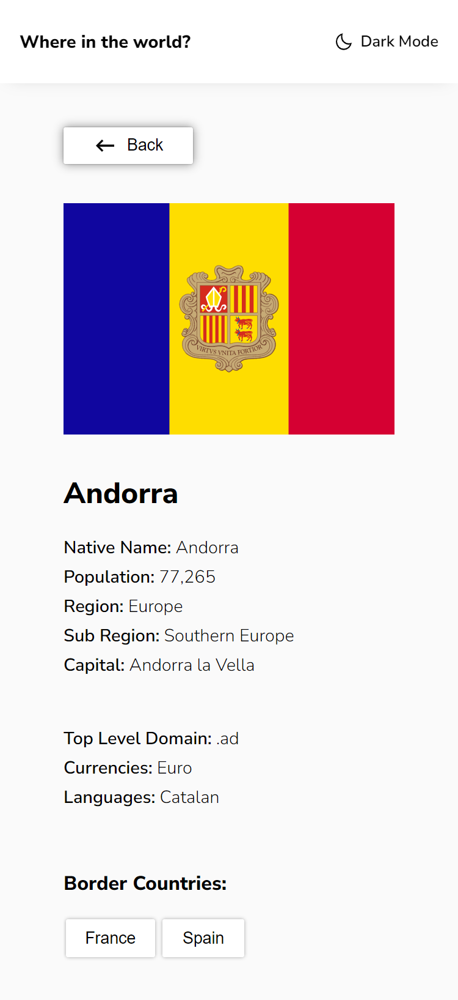
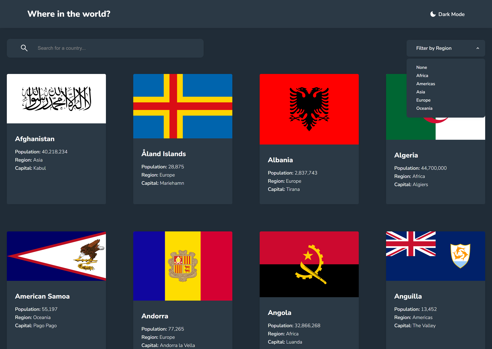
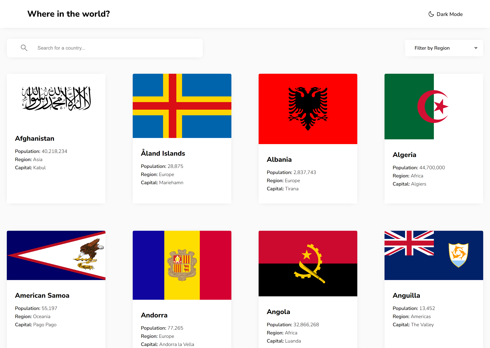
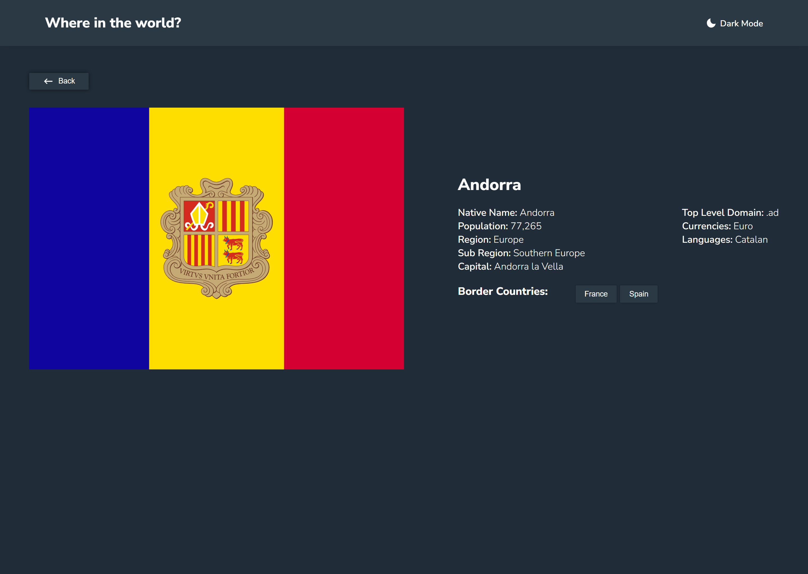
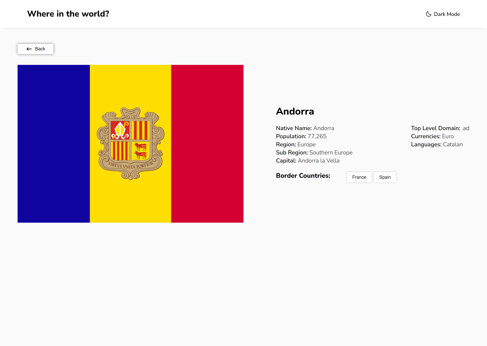

# Frontend Mentor - REST Countries API with color theme switcher solution

This is a solution to the [REST Countries API with color theme switcher challenge on Frontend Mentor](https://www.frontendmentor.io/challenges/rest-countries-api-with-color-theme-switcher-5cacc469fec04111f7b848ca)

## Table of contents

- [Overview](#overview)
  - [The challenge](#the-challenge)
  - [Screenshot](#screenshot)
  - [Links](#links)
- [My process](#my-process)
  - [Built with](#built-with)
  - [Continued development](#continued-development)
- [Author](#author)

## Overview

### The challenge

Users should be able to:

- See all countries from the API on the homepage
- Search for a country using an `input` field
- Filter countries by region
- Click on a country to see more detailed information on a separate page
- Click through to the border countries on the detail page
- Toggle the color scheme between light and dark mode *(optional)*

### Screenshot

#### Mobile View

Search page:

  
  

Country page:

  
  

#### Desktop view

Search page:

  
  

Country page:

  
  

### Links

- Solution URL: [https://github.com/BeltserG/contries-search-with-theme-switcher](https://github.com/BeltserG/contries-search-with-theme-switcher)
- Live Site URL: [https://beltserg.github.io/contries-search-with-theme-switcher](https://beltserg.github.io/contries-search-with-theme-switcher)

## My process

### Built with

Instruments:

- [React](https://reactjs.org/) - UI framework
- [SASS](https://sass-lang.com/) - CSS preprocessor
- [Webpack](https://webpack.js.org/) - Bundling

Principles:
- Semantic HTML5 markup
- Mobile-first workflow
- [FSD](https://feature-sliced.design/) - App architecture

Hints:
- Mode Switch (Dark/Light) was implemented with [useContext()](https://react.dev/reference/react/useContext) hook

### Continued development

- Applying SSR with Next.js
- Developing tests

## Author
- GitHub - [BeltserG](https://github.com/BeltserG)
- Frontend Mentor - [BeltserG](https://www.frontendmentor.io/profile/BeltserG)
- Email - beltsergeorgy@gmail.com
